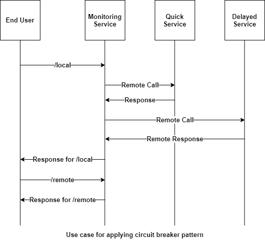
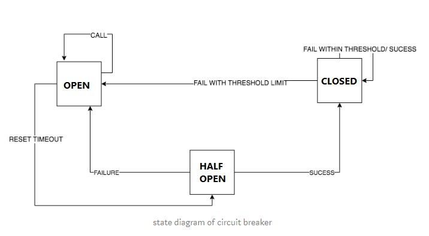

## हेतु

महँगी दूरस्थ सेवा कॉलों को इस प्रकार संभालें कि किसी एक सेवा/घटक की विफलता हो
संपूर्ण एप्लिकेशन को नीचे नहीं लाया जा सकता है, और हम यथाशीघ्र सेवा से पुनः कनेक्ट कर सकते हैं।

## व्याख्या

वास्तविक दुनिया का उदाहरण

> एक ऐसे वेब एप्लिकेशन की कल्पना करें जिसमें स्थानीय फ़ाइलें/छवियां और दूरस्थ सेवाएं दोनों हैं जिनका उपयोग किया जाता है
> डेटा लाया जा रहा है। ये दूरस्थ सेवाएँ कभी-कभी स्वस्थ और उत्तरदायी हो सकती हैं, या बन सकती हैं
> विभिन्न कारणों से किसी समय धीमी और अनुत्तरदायी। तो अगर रिमोट में से एक
> सेवाएँ धीमी हैं या सफलतापूर्वक प्रतिक्रिया नहीं दे रही हैं, हमारा एप्लिकेशन प्रतिक्रिया प्राप्त करने का प्रयास करेगा
> कई थ्रेड्स/प्रक्रियाओं का उपयोग करने वाली दूरस्थ सेवा, जल्द ही वे सभी हैंग हो जाएंगी (जिन्हें भी कहा जाता है)।
> [Thread starvation](https://en.wikipedia.org/wiki/Starvation_(computer_science)) जिसके कारण हमारा संपूर्ण वेब एप्लिकेशन क्रैश हो गया है। हमें पता लगाने में सक्षम होना चाहिए
> यह स्थिति और उपयोगकर्ता को एक उपयुक्त संदेश दिखाएं ताकि वह इसके अन्य हिस्सों का पता लगा सके
> ऐप दूरस्थ सेवा विफलता से अप्रभावित है। इस बीच, अन्य सेवाएँ जो काम कर रही हैं
> सामान्यतः, इस विफलता से अप्रभावित रहकर कार्य करते रहना चाहिए।

साफ़ शब्दों में

> सर्किट ब्रेकर विफल दूरस्थ सेवाओं को शानदार ढंग से संभालने की अनुमति देता है। यह विशेष रूप से तब उपयोगी होता है जब
> हमारे एप्लिकेशन के सभी हिस्से एक-दूसरे से अत्यधिक अलग हैं, और एक घटक विफल हो गया है
> इसका मतलब यह नहीं है कि अन्य हिस्से काम करना बंद कर देंगे।

विकिपीडिया कहता है

> सर्किट ब्रेकर आधुनिक सॉफ्टवेयर विकास में उपयोग किया जाने वाला एक डिज़ाइन पैटर्न है। इसका उपयोग पता लगाने के लिए किया जाता है
> विफलताएं और विफलता को लगातार दोहराए जाने से रोकने के तर्क को समाहित करती है
> रखरखाव, अस्थायी बाहरी सिस्टम विफलता या अप्रत्याशित सिस्टम कठिनाइयाँ।

## प्रोग्रामेटिक उदाहरण

तो, यह सब एक साथ कैसे आता है? उपरोक्त उदाहरण को ध्यान में रखते हुए हम इसका अनुकरण करेंगे
एक सरल उदाहरण में कार्यक्षमता. एक निगरानी सेवा वेब ऐप की नकल करती है और स्थानीय और दोनों बनाती है
दूरस्थ कॉल.

सेवा वास्तुकला इस प्रकार है:



कोड के संदर्भ में, अंतिम उपयोगकर्ता एप्लिकेशन है:

```java
@Slf4j
public class App {

  private static final Logger LOGGER = LoggerFactory.getLogger(App.class);

  /**
   * Program entry point.
   *
   * @param args command line args
   */
  public static void main(String[] args) {

    var serverStartTime = System.nanoTime();

    var delayedService = new DelayedRemoteService(serverStartTime, 5);
    var delayedServiceCircuitBreaker = new DefaultCircuitBreaker(delayedService, 3000, 2,
        2000 * 1000 * 1000);

    var quickService = new QuickRemoteService();
    var quickServiceCircuitBreaker = new DefaultCircuitBreaker(quickService, 3000, 2,
        2000 * 1000 * 1000);

    //Create an object of monitoring service which makes both local and remote calls
    var monitoringService = new MonitoringService(delayedServiceCircuitBreaker,
        quickServiceCircuitBreaker);

    //Fetch response from local resource
    LOGGER.info(monitoringService.localResourceResponse());

    //Fetch response from delayed service 2 times, to meet the failure threshold
    LOGGER.info(monitoringService.delayedServiceResponse());
    LOGGER.info(monitoringService.delayedServiceResponse());

    //Fetch current state of delayed service circuit breaker after crossing failure threshold limit
    //which is OPEN now
    LOGGER.info(delayedServiceCircuitBreaker.getState());

    //Meanwhile, the delayed service is down, fetch response from the healthy quick service
    LOGGER.info(monitoringService.quickServiceResponse());
    LOGGER.info(quickServiceCircuitBreaker.getState());

    //Wait for the delayed service to become responsive
    try {
      LOGGER.info("Waiting for delayed service to become responsive");
      Thread.sleep(5000);
    } catch (InterruptedException e) {
      e.printStackTrace();
    }
    //Check the state of delayed circuit breaker, should be HALF_OPEN
    LOGGER.info(delayedServiceCircuitBreaker.getState());

    //Fetch response from delayed service, which should be healthy by now
    LOGGER.info(monitoringService.delayedServiceResponse());
    //As successful response is fetched, it should be CLOSED again.
    LOGGER.info(delayedServiceCircuitBreaker.getState());
  }
}
```

निगरानी सेवा:

```java
public class MonitoringService {

  private final CircuitBreaker delayedService;

  private final CircuitBreaker quickService;

  public MonitoringService(CircuitBreaker delayedService, CircuitBreaker quickService) {
    this.delayedService = delayedService;
    this.quickService = quickService;
  }

  //Assumption: Local service won't fail, no need to wrap it in a circuit breaker logic
  public String localResourceResponse() {
    return "Local Service is working";
  }

  /**
   * Fetch response from the delayed service (with some simulated startup time).
   *
   * @return response string
   */
  public String delayedServiceResponse() {
    try {
      return this.delayedService.attemptRequest();
    } catch (RemoteServiceException e) {
      return e.getMessage();
    }
  }

  /**
   * Fetches response from a healthy service without any failure.
   *
   * @return response string
   */
  public String quickServiceResponse() {
    try {
      return this.quickService.attemptRequest();
    } catch (RemoteServiceException e) {
      return e.getMessage();
    }
  }
}
```
जैसा कि देखा जा सकता है, यह स्थानीय संसाधनों को सीधे प्राप्त करने के लिए कॉल करता है, लेकिन यह कॉल को लपेट देता है
सर्किट ब्रेकर ऑब्जेक्ट में रिमोट (महंगी) सेवा, जो निम्नानुसार दोषों को रोकती है:

```java
public class DefaultCircuitBreaker implements CircuitBreaker {

    private final long timeout;
    private final long retryTimePeriod;
    private final RemoteService service;
    long lastFailureTime;
    private String lastFailureResponse;
    int failureCount;
    private final int failureThreshold;
    private State state;
    private final long futureTime = 1000 * 1000 * 1000 * 1000;

    /**
     * Constructor to create an instance of Circuit Breaker.
     *
     * @param timeout          Timeout for the API request. Not necessary for this simple example
     * @param failureThreshold Number of failures we receive from the depended service before changing
     *                         state to 'OPEN'
     * @param retryTimePeriod  Time period after which a new request is made to remote service for
     *                         status check.
     */
    DefaultCircuitBreaker(RemoteService serviceToCall, long timeout, int failureThreshold,
                          long retryTimePeriod) {
        this.service = serviceToCall;
        // We start in a closed state hoping that everything is fine
        this.state = State.CLOSED;
        this.failureThreshold = failureThreshold;
        // Timeout for the API request.
        // Used to break the calls made to remote resource if it exceeds the limit
        this.timeout = timeout;
        this.retryTimePeriod = retryTimePeriod;
        //An absurd amount of time in future which basically indicates the last failure never happened
        this.lastFailureTime = System.nanoTime() + futureTime;
        this.failureCount = 0;
    }

    // Reset everything to defaults
    @Override
    public void recordSuccess() {
        this.failureCount = 0;
        this.lastFailureTime = System.nanoTime() + futureTime;
        this.state = State.CLOSED;
    }

    @Override
    public void recordFailure(String response) {
        failureCount = failureCount + 1;
        this.lastFailureTime = System.nanoTime();
        // Cache the failure response for returning on open state
        this.lastFailureResponse = response;
    }

    // Evaluate the current state based on failureThreshold, failureCount and lastFailureTime.
    protected void evaluateState() {
        if (failureCount >= failureThreshold) { //Then something is wrong with remote service
            if ((System.nanoTime() - lastFailureTime) > retryTimePeriod) {
                //We have waited long enough and should try checking if service is up
                state = State.HALF_OPEN;
            } else {
                //Service would still probably be down
                state = State.OPEN;
            }
        } else {
            //Everything is working fine
            state = State.CLOSED;
        }
    }

    @Override
    public String getState() {
        evaluateState();
        return state.name();
    }

    /**
     * Break the circuit beforehand if it is known service is down Or connect the circuit manually if
     * service comes online before expected.
     *
     * @param state State at which circuit is in
     */
    @Override
    public void setState(State state) {
        this.state = state;
        switch (state) {
            case OPEN -> {
                this.failureCount = failureThreshold;
                this.lastFailureTime = System.nanoTime();
            }
            case HALF_OPEN -> {
                this.failureCount = failureThreshold;
                this.lastFailureTime = System.nanoTime() - retryTimePeriod;
            }
            default -> this.failureCount = 0;
        }
    }

    /**
     * Executes service call.
     *
     * @return Value from the remote resource, stale response or a custom exception
     */
    @Override
    public String attemptRequest() throws RemoteServiceException {
        evaluateState();
        if (state == State.OPEN) {
            // return cached response if the circuit is in OPEN state
            return this.lastFailureResponse;
        } else {
            // Make the API request if the circuit is not OPEN
            try {
                //In a real application, this would be run in a thread and the timeout
                //parameter of the circuit breaker would be utilized to know if service
                //is working. Here, we simulate that based on server response itself
                var response = service.call();
                // Yay!! the API responded fine. Let's reset everything.
                recordSuccess();
                return response;
            } catch (RemoteServiceException ex) {
                recordFailure(ex.getMessage());
                throw ex;
            }
        }
    }
}
```

उपरोक्त पैटर्न विफलताओं को कैसे रोकता है? आइए इस परिमित राज्य मशीन के माध्यम से समझें
इसके द्वारा कार्यान्वित किया गया।



- हम सर्किट ब्रेकर ऑब्जेक्ट को कुछ मापदंडों के साथ आरंभ करते हैं: `timeout`, `failureThreshold` और `retryTimePeriod` जो यह निर्धारित करने में मदद करते हैं कि एपीआई कितना लचीला है।
- प्रारंभ में, हम `closed` स्थिति में हैं और एपीआई पर कोई दूरस्थ कॉल नहीं हुई है।
- हर बार जब कॉल सफल हो जाती है, तो हम स्थिति को उसी स्थिति में रीसेट कर देते हैं जैसी वह शुरुआत में थी।
- यदि विफलताओं की संख्या एक निश्चित सीमा को पार कर जाती है, तो हम `open` स्थिति में चले जाते हैं, जो एक ओपन सर्किट की तरह कार्य करता है और दूरस्थ सेवा कॉल को करने से रोकता है, इस प्रकार संसाधनों की बचत होती है। (यहां, हम ```stale response from API``` नामक प्रतिक्रिया लौटाते हैं)
- एक बार जब हम पुन: प्रयास की समय-सीमा पार कर लेते हैं, तो हम `half-open` स्थिति में चले जाते हैं और यह जांचने के लिए दूरस्थ सेवा पर दोबारा कॉल करते हैं कि सेवा काम कर रही है या नहीं ताकि हम ताजा सामग्री पेश कर सकें। एक विफलता इसे वापस `open` स्थिति में सेट कर देती है और दूसरा प्रयास पुनः प्रयास की समयावधि के बाद किया जाता है, जबकि एक सफलता इसे `closed` स्थिति में सेट कर देती है ताकि सब कुछ फिर से सामान्य रूप से काम करना शुरू कर दे।

## क्लास डायग्राम


## प्रयोज्यता

जब सर्किट ब्रेकर पैटर्न का उपयोग करें

- एक दोष-सहिष्णु एप्लिकेशन का निर्माण जहां कुछ सेवाओं की विफलता से संपूर्ण एप्लिकेशन बंद नहीं होना चाहिए।
- लगातार चलने वाले (हमेशा चालू रहने वाले) एप्लिकेशन का निर्माण करना, ताकि इसके घटकों को पूरी तरह से बंद किए बिना अपग्रेड किया जा सके।

## संबंधित पैटर्न

- [Retry Pattern](https://github.com/iluwatar/java-design-patterns/tree/master/retry)

## वास्तविक दुनिया के उदाहरण

* [Spring Circuit Breaker module](https://spring.io/guides/gs/circuit-breaker)
* [Netflix Hystrix API](https://github.com/Netflix/Hystrix)

## श्रेय

* [Understanding Circuit Breaker Pattern](https://itnext.io/understand-circuitbreaker-design-pattern-with-simple-practical-example-92a752615b42)
* [Martin Fowler on Circuit Breaker](https://martinfowler.com/bliki/CircuitBreaker.html)
* [Fault tolerance in a high volume, distributed system](https://medium.com/netflix-techblog/fault-tolerance-in-a-high-volume-distributed-system-91ab4faae74a)
* [Circuit Breaker pattern](https://docs.microsoft.com/en-us/azure/architecture/patterns/circuit-breaker)
